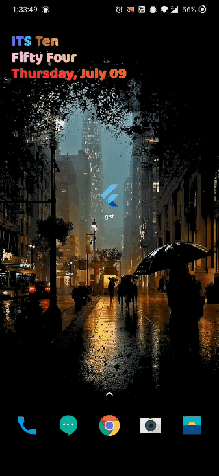

# Gst Application

Research based internship on Gst Application in Flutter using Firebase.

## Aim

we are focusing to create an application in which any one can understand and pay his/her tax. 
The main use of this application will be it can be use anywhere and any time from mobile.

## GIF

## Getting Started

This project is a starting point for a Flutter application.

A few resources to get you started if this is your first Flutter project:

- [Lab: Write your first Flutter app](https://flutter.dev/docs/get-started/codelab)
- [Cookbook: Useful Flutter samples](https://flutter.dev/docs/cookbook)

For help getting started with Flutter, view our
[online documentation](https://flutter.dev/docs), which offers tutorials,
samples, guidance on mobile development, and a full API reference.
